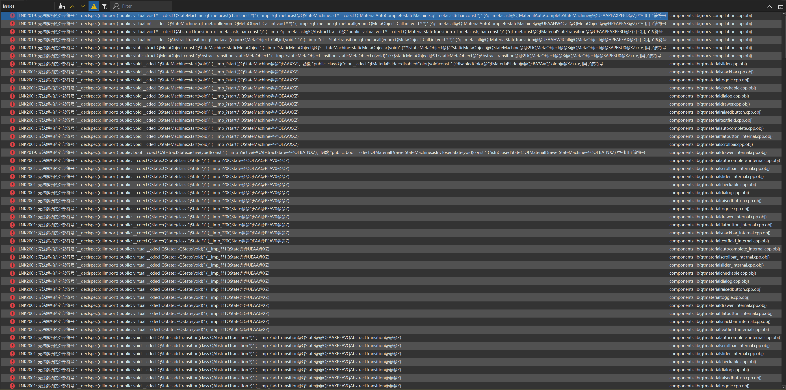

## Way to use this project

Except `add_subdirectory()` to use this project, this project should compile to static library or dynamic library as a separate component.

TODO:

Figure out how to use this project as static/dynamic libary. 

Up to now, we know there will be a `.lib` file after compile, usually add `target_include_directories(${PROJECT_NAME} PRIVATE /path/to/include)` and `target_link_libraries(${PROJECT_NAME} PRIVATE /path/to/.lib/file)` to use a static library in Windows. but we got plenty of compile error as follows:

