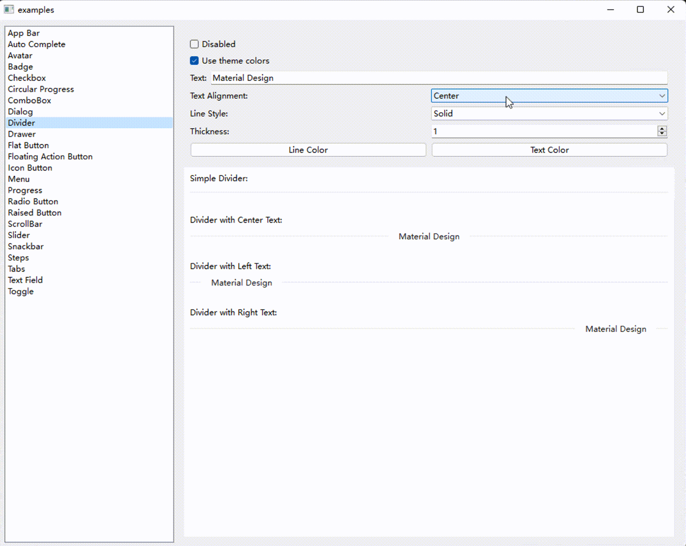

# Qt Material Design Desktop Widgets 

&nbsp;&nbsp;&nbsp;

**YouTube** video preview [available here](http://www.youtube.com/watch?v=21UMeNVBPU4).

---

I've been using Qt for a while, the lack of UI framework is a big problem for me.

After building UI components from scratch for a while, I decided to try reusing other's projects, that is no piece of cake.

I found [qt-material-widgets](https://github.com/laserpants/qt-material-widgets), but sadly it seems to be no longer supported.

Pull requests from other developer, such as [move to cmake](https://github.com/laserpants/qt-material-widgets/pull/50) which inspired me on migrating this project from `qmake` to `CMake`, are not accepted anymore.

I'm very honored to try to take over the maintenance of this project, and welcome all pull requests and issues.

## Overview

The original project only supported the qmake build system on Linux.

This project now treats CMake as the supported build, package, and downstream integration path. qmake files remain as legacy source-tree build files only.


## Usage

### Use as a CMake package

The recommended integration path is the exported CMake package.

For prebuilt GitHub Release archives, see [Using GitHub Release Archives](Docs/ReleaseUsage.md).

Build and install the library first:

```cmake
cmake -S . -B build -DCMAKE_INSTALL_PREFIX=/path/to/install
cmake --build build --config Release
cmake --install build --config Release
```

Then consume it from your application:

```cmake
find_package(QtMaterialWidgets CONFIG REQUIRED)
target_link_libraries(${PROJECT_NAME} PRIVATE QtMaterialWidgets::Widgets)
```

When the install prefix is not in CMake's default search path, configure your application with `-DCMAKE_PREFIX_PATH=/path/to/install`.

The minimal installed-package consumer is available in `examples/consumer`.

### Use as a source subdirectory

You can also embed this repository in another CMake build:

```cmake
add_subdirectory(path/to/qt-material-widgets)
target_link_libraries(${PROJECT_NAME} PRIVATE QtMaterialWidgets::Widgets)
```

### qmake

`qmake` files are still present for legacy local experimentation, but qmake is not part of the verified support contract. It does not provide the CMake package target, install/export rules, resource-pack option, or CTest baseline.

Use the CMake package path for supported downstream integration.

### Run example

1. clone this project

```
git clone https://github.com/Zhang-Tianxu/qt-material-widgets
```

2. open `CMakeLists.txt` in the root directory of this repo by Qt Creator
3. select a build Kit and run

## progress

<table>
  <tbody>
    <tr>
      <td colspan="2" align="center"></td>
    </tr>
    <tr>
      <td>
        App Bar
      </td>
      <td>
        <code>QtMaterialAppBar</code>
      </td>
    </tr>
    <tr>
      <td colspan="2" align="center">
        
      </td>
    </tr>
    <tr>
      <td>
        Auto Complete
      </td>
      <td>
        <code>QtMaterialAutoComplete</code>
      </td>
    </tr>
    <tr>
      <td colspan="2" align="center">
        
      </td>
    </tr>
    <tr>
      <td>
        Avatar
      </td>
      <td>
        <code>QtMaterialAvatar</code>
      </td>
    </tr>
    <tr>
      <td colspan="2" align="center">
        
      </td>
    </tr>
    <tr>
      <td>
        Badge
      </td>
      <td>
        <code>QtMaterialBadge</code>
      </td>
    </tr>
    <tr>
      <td colspan="2" align="center">
        
      </td>
    </tr>
    <tr>
      <td>
        Check Box
      </td>
      <td>
        <code>QtMaterialCheckBox</code>
      </td>
    </tr>
    <tr>
      <td colspan="2" align="center">
        
      </td>
    </tr>
    <tr>
      <td>
        Circular Progress
      </td>
      <td>
        <code>QtMaterialCircularProgress</code>
      </td>
    </tr>
    <tr>
      <td colspan="2" align="center">
        
      </td>
    </tr>
    <tr>
      <td>
        Dialog
      </td>
      <td>
        <code>QtMaterialDialog</code>
      </td>
    </tr>
    <tr>
      <td colspan="2" align="center">
        
      </td>
    </tr>
    <tr>
      <td>
        Drawer
      </td>
      <td>
        <code>QtMaterialDrawer</code>
      </td>
    </tr>
    <tr>
      <td colspan="2">
        
      </td>
    </tr>
    <tr>
      <td>
        FAB
      </td>
      <td>
        <code>QtMaterialFloatingActionButton</code>
      </td>
    </tr>
    <tr>
      <td colspan="2" align="center">
        
      </td>
    </tr>
    <tr>
      <td>
        Flat Button
      </td>
      <td>
        <code>QtMaterialFlatButton</code>
      </td>
    </tr>
    <tr>
      <td colspan="2" align="center">
        
      </td>
    </tr>
    <tr>
      <td>
        Icon Button
      </td>
      <td>
        <code>QtMaterialIconButton</code>
      </td>
    </tr>
    <tr>
      <td colspan="2" align="center">
        
      </td>
    </tr>
    <tr>
      <td>
        Progress
      </td>
      <td>
        <code>QtMaterialProgress</code>
      </td>
    </tr>
    <tr>
      <td colspan="2" align="center">
        
      </td>
    </tr>
    <tr>
      <td>
        Radio Button
      </td>
      <td>
        <code>QtMaterialRadioButton</code>
      </td>
    </tr>
    <tr>
      <td colspan="2" align="center">
        
      </td>
    </tr>
    <tr>
      <td>
        Raised Button
      </td>
      <td>
        <code>QtMaterialRaisedButton</code>
      </td>
    </tr>
    <tr>
      <td colspan="2" align="center">
        
      </td>
    </tr>
    <tr>
      <td>
        Scroll Bar
      </td>
      <td>
        <code>QtMaterialScrollBar</code>
      </td>
    </tr>
    <tr>
      <td colspan="2" align="center">
        
      </td>
    </tr>
    <tr>
      <td>
        Slider
      </td>
      <td>
        <code>QtMaterialSlider</code>
      </td>
    </tr>
    <tr>
      <td colspan="2" align="center">
        
      </td>
    </tr>
    <tr>
      <td>
        Snackbar
      </td>
      <td>
        <code>QtMaterialSnackBar</code>
      </td>
    </tr>
    <tr>
      <td colspan="2" align="center">
        
      </td>
    </tr>
    <tr>
      <td>
        Tabs
      </td>
      <td>
        <code>QtMaterialTabs</code>
      </td>
    </tr>
    <tr>
      <td colspan="2" align="center">
        
      </td>
    </tr>
    <tr>
      <td>
        Text Field
      </td>
      <td>
        <code>QtMaterialTextField</code>
      </td>
    </tr>
    <tr>
      <td colspan="2" align="center">
        
      </td>
    </tr>
    <tr>
      <td>
        Toggle
      </td>
      <td>
        <code>QtMaterialToggle</code>
      </td>
    </tr>
    <tr>
      <td colspan="2" align="center">
        
      </td>
    </tr>
    <tr>
      <td>
        Divider
      </td>
      <td>
        <code>QtMaterialDivider</code>
      </td>
    </tr>
    <tr>
      <td colspan="2" align="center">
        
      </td>
    </tr>
  </tbody>
</table>

#### Implemented components

Detailed installation status is tracked in [Docs/ComponentSurface.md](Docs/ComponentSurface.md).

- [x] App Bar
- [x] Auto Complete
- [x] Avatar
- [x] Badge
- [x] Check Box
- [x] Circular Progress
- [x] Dialog
- [x] Divider
- [x] Drawer
- [x] Floating Action Button
- [x] Flat Button
- [x] Icon Button
- [x] Progress
- [x] Radio Button
- [x] Raised Button
- [x] Scroll Bar
- [x] Slider
- [x] Snackbar
- [x] Tabs
- [x] Text Field
- [x] Toggle

#### Work in progress

- [ ] ComboBox
- [ ] Steps

#### Stub

- [ ] Menu

#### Not implemented 

- [ ] Card
- [ ] Chips
- [ ] Discrete Slider
- [ ] Grid List
- [ ] Icon Menu
- [ ] Search Field
- [ ] Select Field
- [ ] Stepper
- [ ] Subheaders
- [ ] Toolbar
- [ ] List
- [ ] List Item
- [ ] Paper
- [ ] Snackbar Layout
- [ ] Table

## About Android support

example can compile and run properly, but UI not fit to mobile.


